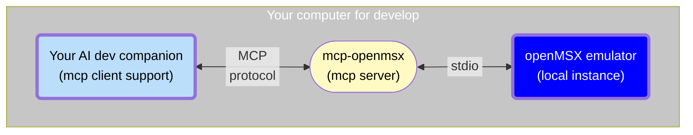

# MCP-openMSX

*"Orchestrating a binary opera where AI conducts, MCP interprets, and openMSX acts as the 8-bit diva."*

A [Model Context Protocol](https://modelcontextprotocol.io/introduction) (MCP) server for automating [openMSX emulator](https://github.com/openMSX/openMSX) instances.

This server provides comprehensive tools for MSX software development, testing, and automation through standardized MCP protocols.

Currently, the MCP server requires Linux to run. It has not been tested on Windows or macOS, although it will likely work on the latter as well.

## 🎯 Project Overview

This project creates a bridge between modern AI-assisted development (e.g. GitHub Copilot, Claude Desktop) and retro computing (MSX systems) by providing:

- **Emulator Control**: Launch, configure, and manage openMSX instances
- **Media Management**: Handle ROM cartridges, floppy disks, and cassette tapes
- **Debugging Tools**: Full CPU debugging with breakpoints, memory inspection, and step execution
- **Video Control**: VDP register manipulation and screen capture
- **Memory Operations**: Read/write RAM, VRAM, and I/O port access
- **Automation**: Keyboard input simulation and savestate management
- **Dual Transport**: Support for both stdio and HTTP transports

## 🏗️ Architecture



The MCP server translates high-level commands from your Copilot AI into `TCL` commands to control `openMSX`, enabling automated MSX software _testing_ and _debugging_.

## 🛠️ Available MCP Tools

### Emulator Control Tools
- `emu_control`: Controls an openMSX emulator: _`launch`, `close`, `powerOn`, `powerOff`, `reset`, `getEmulatorSpeed`, `setEmulatorSpeed`, `machineList`, `extensionList`_.
- `emu_info`: Obtain informacion about the current emulated machine: _`getStatus`, `getSlotsMap`, `getIOPortsMap`_.
- `emu_media`: Manage ROM, disk, and tape media: _`tapeInsert`, `tapeRewind`, `tapeEject`, `romInsert`, `romEject`, `diskInsert`, `diskInsertFolder`, `diskEject`_.
- `emu_vdp`: Manage VDP (Video Display Processor): _`getPalette`, `getRegisters`, `getRegisterValue`, `setRegisterValue`, `screenGetMode`, `screenGetFullText`_.

### Debugging Tools
- `debug_run`: Control execution: _`break`, `isBreaked`, `continue`, `stepIn`, `stepOut`, `stepOver`, `stepBack`, `runTo`_.
- `debug_cpu`: Read/write CPU registers, CPU info, Stack pile, and Disassemble code: _`getCpuRegisters`, `getRegister`, `setRegister`, `getStackPile`, `disassemble`, `getActiveCpu`_.
- `debug_memory`: RAM memory operations: _`selectedSlots`, `getBlock`, `readByte`, `readWord`, `writeByte`, `writeWord`, `advanced_basic_listing`_.
- `debug_vram`: VRAM operations: _`getBlock`, `readByte`, `writeByte`_.
- `debug_breakpoints`: Breakpoint management: _`create`, `remove`, `list`_.

### Automation Tools
- `emu_keyboard`: Send text input to emulator: _`sendText`_.
- `emu_savestates`: Save and restore machine states: _`load`, `save`, `list`_.
- `screen_shot`: Capture emulator screen: _`as_image`, `to_file`_.
- `screen_dump`: Export screen data as BASIC BSAVE.

## 🚀 Quick Start

### Manual installation

```bash
npm install -g @nataliapc/mcp-openmsx
```

### Configuration

Set optional environment variables to customize the server:

```bash
export OPENMSX_EXECUTABLE="openmsx"
export OPENMSX_SHARE_DIR="/usr/share/openmsx"
export OPENMSX_SCREENSHOT_DIR="/my_project/screenshots"
export OPENMSX_SCREENDUMP_DIR="/my_project/screendumps"
export MCP_HTTP_PORT=3000
```

### Manual usage

#### As MCP Server (stdio)

```bash
mcp-openmsx
```

#### As HTTP Server

```bash
MCP_TRANSPORT=http mcp-openmsx
# or
mcp-openmsx http
```

### Basic Usage with Claude Desktop

Add to your `claude_desktop_config.json`:

```json
{
  "mcpServers": {
    "mcp-openmsx": {
      "command": "npx",
      "args": ["@nataliapc/mcp-openmsx"],
      "env": {
        "OPENMSX_SHARE_DIR": "/usr/share/openmsx"
      }
    }
  }
}
```

### Basic Usage with VSCode

* Install [Github Copilot extension](https://code.visualstudio.com/docs/copilot/overview)
* Add to your workspace a file `.vscode/mcp.json` with:

#### stdio mode

```json
{
  "servers": {
    "mcp-openmsx": {
      "command": "npx",
      "args": ["@nataliapc/mcp-openmsx"],
      "env": {
        "OPENMSX_SHARE_DIR": "/usr/share/openmsx"
      }
    }
  }
}
```
**Note:** Environment variables are optional.

#### http mode

```json
{
  "servers": {
    "mcp-openmsx": {
      "type": "http",
      "url": "http://localhost:3000/mcp",
      "headers": { }
    }
  }
}
```

**Note:** The MCP HTTP Server must be running standalone in the same computer or in another (`make run_http`).


## 💡 Development

### Prerequisites

- Node.js >= 18.0.0
- TypeScript
- openMSX emulator installed

### Building

```bash
git clone https://github.com/nataliapc/mcp-openmsx.git
cd mcp-openmsx/mcp-server
npm install
npm run build
```

### Running in Development

```bash
npm run dev
```

## License

GPL2 License - see [LICENSE](LICENSE) file for details.

## Contributing

Contributions are welcome! Please feel free to submit a Pull Request.

## Support

For issues and questions, please use the [GitHub Issues](https://github.com/nataliapc/mcp-openmsx/issues) page.

---
